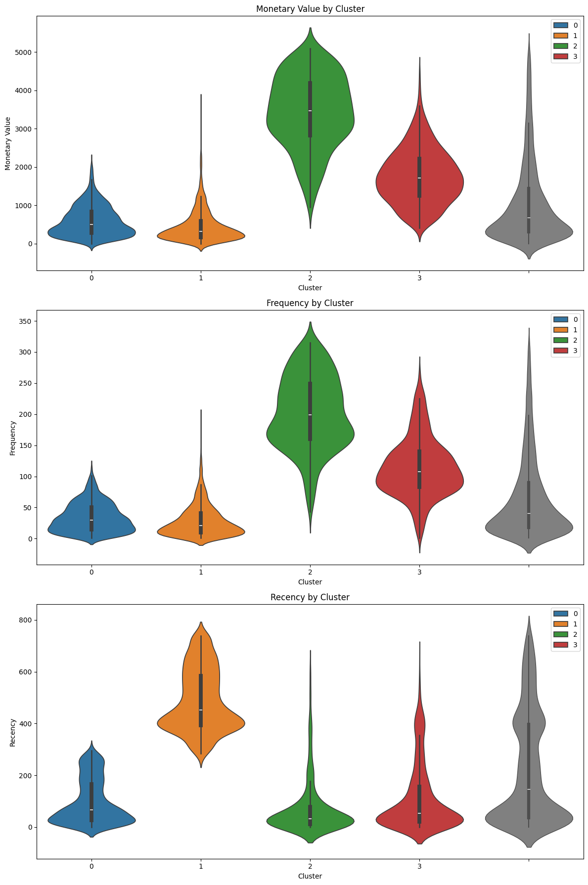
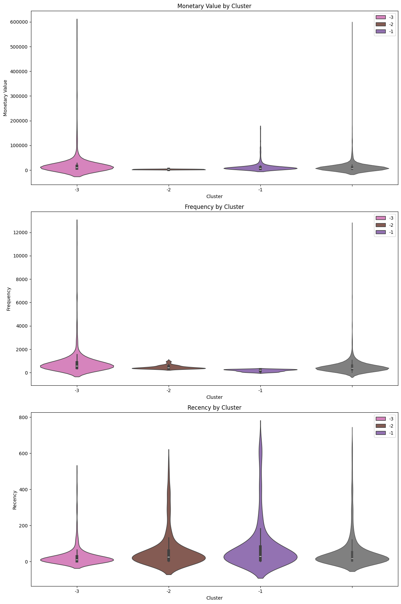
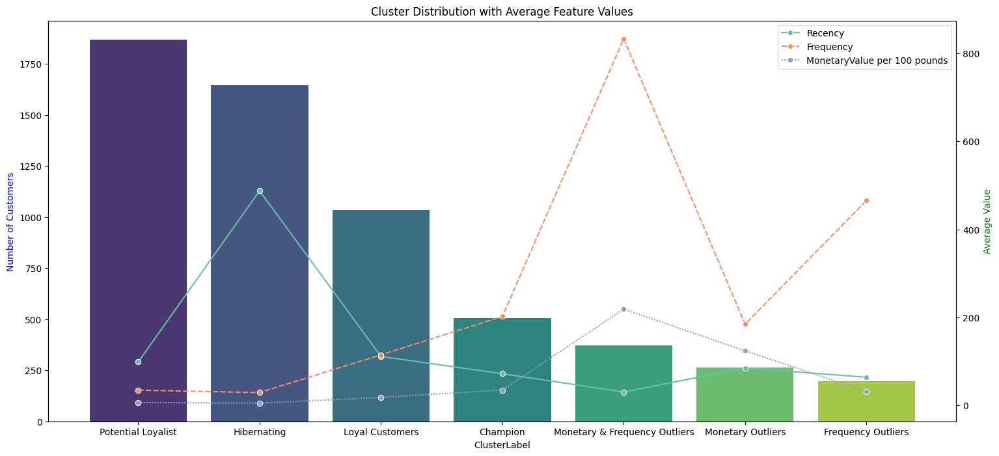

# Online-retail-data-analysis

This is a project to analyze and segment customers using RFM framework of online retail dataset which contains all the transactions occurring for a UK-based and registered, non-store online retail between 01/12/2009 and 09/12/2011.

## More about dataset:

- The company mainly sells unique all-occasion gift-ware
- Many customers of the company are wholesalers

Source : https://archive.ics.uci.edu/dataset/502/online+retail+ii

## Additional Variable Information

1. InvoiceNo: Invoice number. Nominal. A 6-digit integral number uniquely assigned to each transaction. If this code starts with the letter 'c', it indicates a cancellation. 

2. StockCode: Product (item) code. Nominal. A 5-digit integral number uniquely assigned to each distinct product.

3. Description: Product (item) name. Nominal. 

4. Quantity: The quantities of each product (item) per transaction. Numeric.	

5. InvoiceDate: Invice date and time. Numeric. The day and time when a transaction was generated. 

6. UnitPrice: Unit price. Numeric. Product price per unit in sterling (£). 

7. CustomerID: Customer number. Nominal. A 5-digit integral number uniquely assigned to each customer. 

8. Country: Country name. Nominal. The name of the country where a customer resides.

## Knowledge used in this project

### RFM framework

- RFM is a model for customer segmentation into clusters based on their spending habits, which is a way of data-driven marketing
- R stands for Recency, How recently a customer has made a purchase
- F stands for Frequency, How often a customer makes a purchase
- M stands for Monetary, How much money a customer spends on purchases
- We can use these 3 values to identify scores for each customer and group them into clusters
- RFM helps us understand our customers and what actions should we do for each one.

**source**
- https://www.investopedia.com/terms/r/rfm-recency-frequency-monetary-value.asp
- https://everydaymarketing.co/business-and-marketing-case-study/data/rfm-analysis-fo-customer-segmentation-from-behavior-transaction-data/
- https://doctorease.co/en/what-is-rfm/

### K-means clustering
- K-means clustering is an unsupervised learning algorithm used for data clustering, which groups unlabeled data points into groups or clusters
- K-means is an iterative, centroid-based clustering algorithm that partitions a dataset into similar groups based on the distance between their centroids. The centroid, or cluster center, is either the mean or median of all the points within the cluster depending on the characteristics of the data.

- We will try to use **inertia** and **Silhouette score** to decide which **k (number of cluster)**  should we use

#### Inertia
**Inertia** measures how well a dataset was clustered by K-Means. To find the optimal K for a dataset, use the Elbow method; find the point where the decrease in inertia begins to slow

#### Silhouette score

**Silhouette score** is a metric used to calculate the goodness of a clustering technique. Its value ranges from -1 to 1. 
- 1: Means clusters are well apart from each other and clearly distinguished.
- 0: Means clusters are indifferent, or we can say that the distance between clusters is not significant.
- 1: Means clusters are assigned in the wrong way.

**Source**
- https://www.ibm.com/topics/k-means-clustering
- https://www.codecademy.com/learn/dspath-unsupervised/modules/dspath-clustering/cheatsheet
- https://towardsdatascience.com/silhouette-coefficient-validating-clustering-techniques-e976bb81d10c

## Task

### Exploratory Data Analysis
- There are 2 sheets in excel file, which each sheet contains approximately 500,000 records
- There are some duplicate records from sheet 2009-2010 in sheet 2010-2011
- There are null values in 2 columns only which are ***Description (4275 records)*** and ***Customer ID (235151 records)****
- There are some records that ***Quantity*** or ***Price*** is ***minus(-)*** because of dept paying or cancelation
- There are many records which ***InvoiceNo's format*** not align with the rule
- There are too many records which ***StockCode's format*** not align with the rule and they seem meaningful

### Data cleaning
1. dropping out all null records
2. Format InvoiceDate into dd/mm/yyyy
3. Type casting Customer ID from float => string
4. Filter out non-legit Invoice column
5. Filter out minus Price column
6. Filter out minus Quantity column

**<u>Summary</u>** : Dropped about 25% of records during cleaning

### Feature engineering
1. Daily Summary (daily transaction)
2. Customer Dataframe (per-customer summary)
3. Top 10 selling products
4. Top 10 customers with high spending and frequency of buying
5. K-mean clustering of customers (non-outlier group & outlier group)

## non-outlier group's clustering

### Cluster 0 : Potential Loyalist
- Violin plot analysis => their monetary and frequency are almost equal to median of total data and recency is very low

- Characteristic => They are customer who didn't make much purchase but spend quite high and they just recenty spent something with us.

- Suggestion => We should make a haste to make these customers feel impressed and confident in our brand

### Cluster 1 : Hibernating
- Violin plot analysis => their monetary and frequency are quite low compared to all data but recency is very high

- Characteristic => They have average payment and frequency but it's been a long since their last purchase

- Suggestion => They are still worth to bring them back by doing some campaigns or promotions

### Cluster 2 : Champion
- Violin plot analysis => their monetary and frequency are very high compared to which of all data and recency is also very low

- Characteristic => The most important customer which frequently buy and spent a lot of money recently.

- Suggestion =>  We need to keep them for the best and don't let them go no matter what

### Cluster 3 : Loyal Customers
- Violin plot analysis => they have similiar RFM's behavior with cluster 2 but tend to have much lower value except for recency which is a little higher

- Characteristic => They are valueable customers with high spending and frequency of buying even they didn't make any order recenly.

- Suggestion => We should do research on what they like and the reasons they buy our products to deliver straightforward services

## outlier group's clustering

### Cluster -1 (Monetary Outliers) 
- Characteristic => High spenders but not necessarily frequent buyers. Their purchases are large but infrequent

- Suggestion => Focus on maintaining their loyalty with personalized offers that align with their amount of spending

### Cluster -2 (Frequency Outliers):
- Characteristic => Frequent buyers who spend less per purchase. These customers are consistently engaged but might benefit from upselling opportunities

- Suggestion => Implement loyalty programs or bundle deals to encourage higher spending per visit

### Cluster -3 (Monetary & Frequency Outliers):
- Characteristic => extreme spending and frequent purchases. They are likely your top-tier customers who require special attention

- Suggestion =>  Develop VIP programs or exclusive offers to maintain their loyalty and encourage continued engagement

## Summary Visualization

